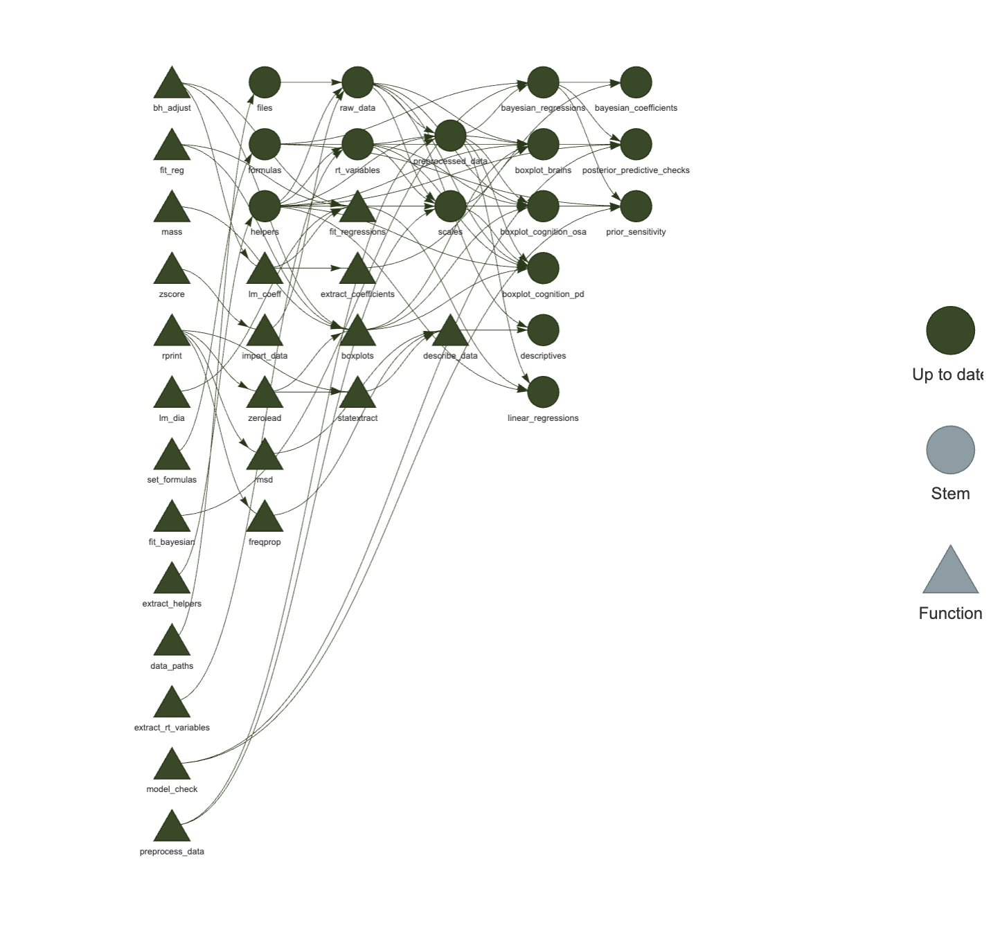

# pd-hippo-osa
My humble addition to Filip Růžička's project about the association of obstruction sleep apnea with subcortical brain volume in early PD.

The [renv](https://rstudio.github.io/renv/) package was used to create reproducible environment for the project.
To set-up R environment for reproduction of our results, run:

```
#install.packages("renv")
renv::restore()
```

The [targets](https://docs.ropensci.org/targets/) package was used to create a reproducible analysis pipeline.
To run the analyses, use the following code:

```
#install.packages("targets")
targets::tar_make()
```

The current pipeline looks as follows:

